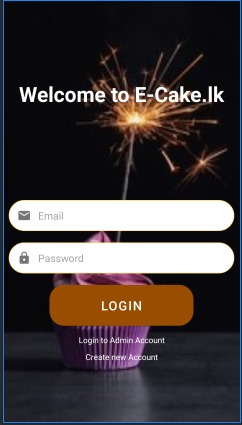

[![Contributors][contributors-shield]][https://github.com/Sasankavikum/ecake/graphs/contributors]

<!-- PROJECT LOGO -->
 

    

<!-- TABLE OF CONTENTS -->

  
Table of Contents

  <ol>
    <li>
      <a href="#about-the-project">About The Project</a>
      <ul>
        <li><a href="#built-with">Built With</a></li>
      </ul>
    </li>
    <li>
      <a href="#getting-started">Getting Started</a>
    </li>
    <li><a href="#Contact">Contact</a></li>
  </ol>

<!-- ABOUT THE PROJECT -->
## About The Project

E-Cake.lk is an online cake ordering platform and the application is built in order to facilitate the buying and selling of homemade cake items. There are many apps developed for transport, delivery of foods, and educational based. But none of these apps are centered on providing a real deeming introduction for the sale of local delicacies like cakes. The product being a main necessity at special events has a huge demand in the present market. However, the penetration of the specified food category is greatly diminished in the absence of such an application. General food delivery applications in the market arguably would not facilitate. The need for a special app with these requirements was not evident in the online stores and less innovative to the seller.

Here's why:
* Easy to order cakes from your fav buyer.
* User frendly UI.

A list of commonly used resources that I find helpful are listed in the acknowledgements.

### Built With

This section should list any major frameworks that you built your project using. Leave any add-ons/plugins for the acknowledgements section. Here are a few examples.
* [Android Studio](https://developer.android.com/studio)
* [Java](https://www.oracle.com/java/)
* [Fire Base](https://firebase.google.com/)

<!-- CONTACT -->
## Contact

👤 Mayantha Karunanayake
- GitHub: [@githubhandle](https://github.com/KMSMKarunanayake)
- Twitter: [@twitterhandle]()
- LinkedIn: [LinkedIn]()

👤 Udaya Ranasinghe
- GitHub: [@githubhandle](https://github.com/UdayaR92)
- Twitter: [@twitterhandle]()
- LinkedIn: [LinkedIn]()

👤 Randimal Ranasinghe
- GitHub: [@githubhandle](https://github.com/RMRandi)
- Twitter: [@twitterhandle]()
- LinkedIn: [LinkedIn](http://linkedin.com/in/randimal-ranasinghe-8a284a167)

👤 Sasanka Vitharana
- GitHub: [@githubhandle](https://github.com/Sasankavikum)
- Twitter: [@twitterhandle](https://twitter.com/SasaVikum)
- LinkedIn: [LinkedIn](https://www.linkedin.com/in/sasanka-vitharana-607768181/)

Project Link: [https://github.com/your_username/repo_name](https://github.com/Sasankavikum/ecake)
